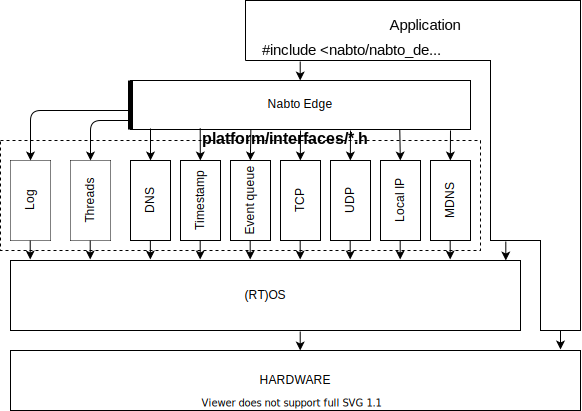
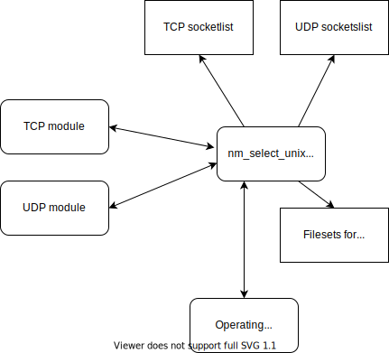
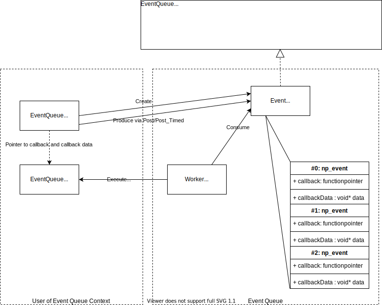

# Platform Integration Howto

This document is a short guide on how to create and integration to a
new platform for Nabto Edge.

## Overall architecture

<p align="center">

</p>

Nabto Edge needs to know about the underlying platform it is running on.
The way to "inform" Nabto Edge about this platform is to implement a list
of functions and supply Nabto Edge with these functions. The functions are defined in .h files, function pointers are supplied to Nabto Edge via setup of structs.

The integration consist of three types:

  1. First type (`src/api/nabto_device_platform.h` which is not in the
drawing) which is a list of functions that are only used to bootstrap
and teardown the integration interfaces.
  2. Another type (threads `src/api/nabto_device_threads.h`) which is
a list of functions linked into the target that the Nabto platform
uses at runtime.
  3. The last type is a type of functions and possible user data setup
via structs and initialized and torn down by the first mentioned
functions and used by the platform at runtime to interact with the
underlying operating system (or/and hardware). These
functions/interfaces can be found in the `src/platform/interfaces`
folder.

For Nabto to run on a specific target it needs to know about:

1. DNS - how the system resolves hostnames to ip addresses (both ipv4:A and ipv6:AAAA addresses)
2. Timestamp - interface for Nabto Edge to know about the current time for scheduling events
3. Event Queue - put events on a queue for serialized (under mutex) execution, which minimizes/optimizes callstacks.
4. TCP - specify TCP operations on the specific target
5. UDP - specify UDP operations on the specific target
6. Local ip - specify how to find the local-ip address(es) of the device (ie. which IP does the target have on the local network)
7. MDNS - specify/setup MDNS interface for local discovery


## Components which are needed for a custom platform.

First of all, the Nabto Edge implementation files need to be included in the
development tool/IDE of the new platform.

The specific needed list of files can be seen in `nabto_files.cmake` which also could be
used for IDEs capable of using cmake.

Once this is done, the Nabto Edge system needs to be supplied with knowledge of the platform/hardware it is running on.
3 major files need to be examined for this:

### `api/nabto_device_platform.h`
This file contains 3 functions: an init, a deinit and a stop
function. That is, functions needed for bootstrap and teardown of the system.
These functions are called when a device is created,
destroyed and stopped. The init function should call the appropriate setter functions to setup the integration modules for the platform.

### `api/nabto_device_integration.h`

The purpose of these functions is to be called from the `nabto_device_platform_init` function to setup the module struct of
`src/platform/interfaces/*.h` (described later) via appropriate setter functions and to
provide the overall functionality which is required to run on a specific platform.

### Understanding nabto_device_platform.h and nabto_device_device_integration.h setup in an integration

For better understanding the link between the initialization of a device and the platform integration, please refer to the next diagram.

<p align="center">

</p>

The call sequence and initialization of the integration modules will start when the main program initializes a new `NabtoDevice`, something like:

```
NabtoDevice* device = nabto_device_new();
```

This will at some point call the initialization of the integration interface (`nabto_devcie_platform_init`) which has the responsibillity to setup the different integration modules (tcp, udp, mdns, timestamp etc.) via calling the appropriate `nabto_device_interation_set_<modulename>_impl()`.


#### Platform specific data utility functions `nabto_device_integration_set_platform_data` and `nabto_device_integration_get_platform_data`

When setting up the integration modules, the integrator will probably need to allocate different types of resources. These resources will need to be deallocated later on when/if the Nabto platform is stopped.

This can be accomplished by setting a pointer to the user specified data via the `nabto_device_integration_set_platform_data` and `nabto_device_integration_get_platform_data` functions which are reachable inside both the `nabto_device_platform_init`, `nabto_device_platform_init` and `nabto_devcie_platform_stop` function. This way a pointer to the data can be created and stored in init and deallocated in `deinit` and `stop`.

If the integration is sure that only one instance of the nabto device is started on a specific device (via `nabto_device_new()`), this user specified data could reside in a static single allocated location (and there will be no need for either the `nabto_device_integration_set_platform_data` or `nabto_device_integration_get_platform_data`). For the general case multiple devices could run inside the same environment and memory, so the functions are supplied.


### `api/nabto_device_threads.h`

The api `nabto/nabto_device.h` is a thread safe API, which also
exposes functionality which can block the system. The system currently
also need to have a thread implementation. The thread
abstraction defines threads, muteces and condition variables.

See the header file for more information or take a look at the existing implementations in the
`src/modules/threads` folder.

Currently, for Nabto Edge to run, the system needs a threads implementation, condition variables and
muteces. It is planned (the platform is made ready for) that in future versions the platform can be
run onto a single-thread platform. This is the reason why integrations dependent on system calls are
asynchronous / nonblocking as explained later.

#### Threads

The integration needs to supply the following function linked onto the platform:

```
struct nabto_device_thread* nabto_device_threads_create_thread(void);
void nabto_device_threads_free_thread(struct nabto_device_thread* thread);
void nabto_device_threads_join(struct nabto_device_thread* thread);
np_error_code nabto_device_threads_run(struct nabto_device_thread* thread,
                                       void *(*run_routine) (void *), void* data);

```
The above functions are assumed to be well-known by the integrator - if not the case, it would be a good idea to explore pthreads interface on Linux.

* `nabto_device_threads_create_thread` : Shall allocate the needed resources for a new thread
* `nabto_device_threads_free_thread` : Shall deallocate the resources allocated in the `create` function
* `nabto_device_threads_join` : Shall make the current caller thread join the to the function given thread
* `nabto_device_threads_run` : Shall start the given thread on the given function with the given data


#### Condition variables

The Nabto platform is dependent on condition variables for synchronization between threads.
The functions needed at link time is:

```
struct nabto_device_condition* nabto_device_threads_create_condition(void);
void nabto_device_threads_free_cond(struct nabto_device_condition* cond);
void nabto_device_threads_cond_signal(struct nabto_device_condition* cond);
void nabto_device_threads_cond_wait(struct nabto_device_condition* cond,
                                    struct nabto_device_mutex* mut);
void nabto_device_threads_cond_timed_wait(struct nabto_device_condition* cond,
                                          struct nabto_device_mutex* mut,
                                          uint32_t ms);
```

The implementation should follow the pthread semantics of the similar functions.

#### Mutex

The Nabto platform needs an mutex abstraction to synchronize access to shared memory and variables.
The function provided by the integration and needed at link time is:

```
struct nabto_device_mutex* nabto_device_threads_create_mutex(void);
void nabto_device_threads_free_mutex(struct nabto_device_mutex* mutext);
void nabto_device_threads_mutex_lock(struct nabto_device_mutex* mutex);
void nabto_device_threads_mutex_unlock(struct nabto_device_mutex* mutex);
```

Just like the condition abstraction, the function should follow the same semantics as the pthreads mutex abstraction.

## Example integration

In the directory `platform_integration_example` an example integration can be viewed. This example works on UNIX systems so
modules which works on such a system have been choosen.

## Example of a simple module - struct np_timestamp_functions

This is one of the most simple integration interfaces, so it is a good place to start.  This
interface tells Nabto Edge how to get the current time from the system. This is used to keep track
of retransmissions of internet communication etc. The interface can be found in
`nabto-embedded-sdk/src/platform/interfaces/np_timestamp.h` and looks like this:

```
struct np_timestamp_functions {
    /**
     * Return current timestamp as milliseconds the timestamp should
     * be a monotonic value which wraps around whenever the value
     * reaches 2^32. The precision is not critical.
     *
     * @param  data  The timestamp object data.
     * @return  The current timestamp in milliseconds.
     */
    uint32_t (*now_ms)(struct np_timestamp* obj);
}

struct np_timestamp {
    const struct np_timestamp_functions* vptr;
    // Pointer to data which is implementation specific
    void* data;
};

```
The np_timestamp struct defines the modules data (`void* data`) and the functions (`struct np_timestamp_functions* vptr`). The data section is a pointer that is fully up to the implementation integration to use and implement or not use at all.

The `np_timestampe_functions` defines a set of functions that the integration modules supply. For the timestamp module this is very simple since it is only one function `uint32_t ts_now_ms(struct np_timestamp* obj)`

On Linux this interface could be accomplished by making the following function (please refer to the `clock_gettime` function):

```
uint32_t ts_now_ms(struct np_timestamp* obj)
{
    struct timespec spec;
    clock_gettime(CLOCK_REALTIME, &spec);
    return ((spec.tv_sec * 1000) + (spec.tv_nsec / 1000000));
}
```

To create the np_timestamp_functions table you could do the following:

```
static struct np_timestamp_functions vtable = {
    .now_ms               = &ts_now_ms
};
```

And to make a function that setup the np_timestamp struct is would look like:

```
struct np_timestamp nm_unix_ts_create()
{
    struct np_timestamp ts;
    ts.vptr = &vtable;
    ts.data = NULL;
    return ts;
}
```

Note this implementation of np_timestamp does not use the user supplied data for anything.

Calling the function above would setup a np_timestamp like this:

<p align="center">

</p>

To setup the timestamp integration modules the intergrator could now do something like:

```
np_error_code nabto_device_platform_init(struct nabto_device_context* device, struct nabto_device_mutex* eventMutex) {

    ...

    struct np_timestamp timestampImpl = nm_unix_ts_create();
    nabto_device_integration_set_timestamp_impl(device, &timestampImpl);

    ...

}
```

Not that the `nabto_device_integration_set_timestamp_impl` functions all copy the implementation structs even though they are pointers (to be sure that integrators do not make a mistake of deallocating them too soon).

Note: if the `ts.data` is initialized with allocated user data, this data must be deallocated when the `nabto_device_platform_deinit` is called. Pointers to the allocated user data can be collected in a struct or similar and be kept via the the `nabto_device_integration_set_platform_data` utility function and be reached by using the identical get function (see earlier explanation).

## Example of a module with medium complexity - struct np_dns_functions

The Nabto platform relies on DNS to resolve hostnames to ip addresses. This functionality is supplied to Nabto via the `struct np_dns` structure. Just like the `np_timestamp` structure, the module consists of a pointer to possible userdata and a pointer to a function list providing needed DNS functionallity.

All in all, the two important structs looks like this:

```
struct np_dns {
    const struct np_dns_functions* vptr;
    // Pointer to implementation specific data.
    void* data;
};

struct np_dns_functions {
    /**
     * Resolve ipv4 addresses for the host name.
     *
     * The completion event shall be resolved when the dns resolution
     * has either failed or succeeded.
     *
     * @param obj  Dns implemetation object.
     * @param host  The host to resolve.
     * @param ips  The array to store the resolved ips in.
     * @param ipsSize  The size of the ips array.
     * @param ipsResolved  The number of ips put in the the ips array.
     * @param completionEvent  The completion event.
     */
    void (*async_resolve_v4)(struct np_dns* obj, const char* host, struct np_ip_address* ips, size_t ipsSize, size_t* ipsResolved, struct np_completion_event* completionEvent);

    /**
     * Resolve ipv6 addresses for the host name.
     *
     * The completion event shall be resolved when the dns resolution
     * has either failed or succeeded.
     *
     * @param obj  Dns implementation object.
     * @param host  The host to resolve.
     * @param ips  The array to store the resolved ips in.
     * @param ipsSize  The size of the ips array.
     * @param ipsResolved  The number of ips put in the the ips array.
     * @param completionEvent  The completion event.
     */
    void (*async_resolve_v6)(struct np_dns* obj, const char* host, struct np_ip_address* ips, size_t ipsSize, size_t* ipsResolved, struct np_completion_event* completionEvent);

};
```

Basically two functions above are doing somewhat the same: Lookup a hostname (`char* host`) and return the resolved ip addresses in a given array (`struct np_ip_address* ips`) of a given size (`size_t ipsSize` ie. the maximal ip adresses that can be returned in the array) and return the number of resolved addresses (`size_t* ipsResolved`).

So far so good, not much different than the timestamp interface. But since getting a timestamp is a local operation that generally is fast and non blocking and that the Nabto platform has to guarantee not to be blocking the system, the timestamp interface doesn't need more specification.

The initialization etc. is not described here as it is the same as timestamp.

The important difference to the timestamp implementation is the `np_completion_event` and `async` notation. Since DNS resolving can be a blocking function with possible very long timeouts special care needs to be taken. This is done via an async pattern using completion events. For the integrator, the only important function is the `np_completion_event_resolve` :

```
/**
 * Resolve a completion event.
 *
 * The completion event is resolved from the internal event queue.
 *
 * @param completionEvent  The completion event to resolve.
 * @param ec  The error code
 */
void np_completion_event_resolve(struct np_completion_event* completionEvent, np_error_code ec);
```

The semantics of async functions is that they are called with a specific request (hostname and array to return resolved ip addresses) and the function can then start an asynchronous operation and return the execution thread back to the platform. But once the function has computed the result of the request, the contract is that the function calls `resolve` function on the given `np_completion_event`.

To implement this on Linux, requires special care since the resolving of hostnames is a blocking operation. Therefore a producer/consumer pattern is used by which an "asynchronous" consumer thread (ie. it is not in sync with the caller thread) is consuming (hostname,resultarray,np_completion_events) from a queue and the caller thread is the producer of (hostnames,resultarray,np_completion_events) to this same queue. Once the consumer has resolved a hostname, the solved adresses is entered into the resultarray and the np_completion_event_resolve function is called with completion_event informing the platform that the result is now ready. This document will not go deeper into the decription of the Linux implementation, but the implementation can be found in `modules/dns/unix/nm_unix_dns.c`.

Instead an example of integration with the ESP32 LWIP DNS is given here. This example can be found in the github repository `nabto5-esp-eye` and in the source file: `common_components/nabto_device/src/esp32_dns.c`

Both the v4 and v6 resolve function will use the same generic function with nearly identical function signatures except it has a `u8_t family` parameter that informs the function which IP type (v4 or v6) it needs to resolve.

```
struct nm_dns_resolve_event {

    struct np_ip_address* ips;
    size_t ipsSize;
    size_t* ipsResolved;
    const char* host;
    u8_t family;
    struct np_completion_event* completionEvent;
};

void esp32_async_resolve(struct np_dns_resolver* resolver, u8_t family, const char* host, struct np_ip_address* ips, size_t ipsSize, s
ize_t* ipsResolved, struct np_completion_event* completionEvent)
{

    NABTO_LOG_TRACE(LOG, "esp_async_resolve:%s", host);
    if (resolver->stopped) {
        np_completion_event_resolve(completionEvent, NABTO_EC_STOPPED);
        return;
    }
    struct nm_dns_resolve_event* event = calloc(1,sizeof(struct nm_dns_resolve_event));
    event->host = host;
    event->ips = ips;
    event->ipsSize = ipsSize;
    event->ipsResolved = ipsResolved;
    event->completionEvent = completionEvent;
    event->family = family;

    ip_addr_t addr;
    err_t status = dns_gethostbyname(host, &addr, esp32_dns_resolve_cb, event);
    if (status == ERR_OK) {
        *ipsResolved = 0;
        free(event);

        // callback is not going to be called.
        if(family == LWIP_DNS_ADDRTYPE_IPV4) {
            memcpy(ips[0].ip.v4, &addr.u_addr.ip4.addr, 4);
            *ipsResolved = 1;
        }
        np_completion_event_resolve(completionEvent, NABTO_EC_OK);
        return;

    }  else if (status == ERR_INPROGRESS) {
        // callback will be called.
        return;
    } else {
        free(event);
        np_completion_event_resolve(completionEvent, NABTO_EC_UNKNOWN);
    }
    return;
}
```

The function uses an utility struct (`nm_dns_resolve_event`) which basically records the function parameters set.
Once this is done, the function will try to resolve the given hostname by calling `dns_gethostbyname(host, &addr, esp32_dns_resolve_cb, event);` which on ESP32 either returns the answer straight away (because the answer has already been resolved and is located in the ESP32 DNS cache) or will return with an answer that it will start the operation and once the hostname is resolved it will call the given callback (with the supplied argument, which in the implementation is the event).

In event of a fast return with the resolved hostname, the function is simple, copy the address to the result array, free the event struct and call `np_completion_event_resolve` with the given completion event as argument. If the resolve happens via the callback, it is a little more (but not much) complicated. The callback looks something like this:

```
void esp32_dns_resolve_cb(const char* name, const ip_addr_t* ipaddr, void* userData)
{
    struct nm_dns_resolve_event* event = userData;

    struct np_ip_address* ips = event->ips;
    struct np_completion_event* completionEvent = event->completionEvent;

    NABTO_LOG_TRACE(LOG, "esp_async_resolve callback recieved");


    if (ipaddr == NULL) {
        NABTO_LOG_TRACE(LOG, "esp_async_resolve callback - no adresses found");
        free(event);
        np_completion_event_resolve(completionEvent, NABTO_EC_UNKNOWN);
        return;

    } else {
        if(event->family == LWIP_DNS_ADDRTYPE_IPV4) {
            NABTO_LOG_TRACE(LOG, "esp_async_resolve callback - found: %s",ipaddr_ntoa(ipaddr));
            memcpy(ips[0].ip.v4, &ipaddr->u_addr.ip4.addr, 4);
            *event->ipsResolved = 1;
            free(event);
            np_completion_event_resolve(completionEvent, NABTO_EC_OK);
            return;
        }
    }
    free(event);
    *event->ipsResolved = 0;
    np_completion_event_resolve(completionEvent, NABTO_EC_UNKNOWN);

}
```

The utility event struct is given as argument to the callback. The resolved address is copied to the result array pointed to inside the event, the event is deallocated and the completionevent is resolved.

## Example of a module with high complexity - struct np_udp_functions / np_tcp_functions

The integration interfaces for UDP and TCP communication is probably the most complicated integration. The semantics of each function is not hard to understand but since most operating systems offers blocking system calls they all require an extra wrapper layer to be implemented. Blocking functions are not friendly for embedded system/platforms that needs to be responsive, so Nabto relies on async implementations instead.

Let's look at an example from the `np_tcp.h` interface. This interface defines an `async_read` function to be implemented. The contract for this function is "simple": Wait on the socket until the sender (other end) sends data to you and once this happens, resolve the completion event. Also, that you need to return the execution thread immediately (it is async) so that the platform can carry on other execution for maximum responsivenes. Here's the definition:

```
    /**
     * Read data from a socket.
     *
     * The completion event shall be resolved when a result of the
     * operation is available.
     *
     * @param sock  The socket resource.
     * @param buffer  The buffer to write data to.
     * @param bufferLength  The length of the buffer.
     * @param readLength  The length of received data.
     * @param completionEvent  The completion event to resolve when data has been read.
     */
    void (*async_read)(struct np_tcp_socket* sock, void* buffer, size_t bufferLength, size_t* readLength, struct np_completion_event* completionEvent);
```

To accomplish this on a posix like blocking system is a little more complicated (when first encountered) than the description/contract says. One way to implement this is to use the `select` function by which a thread can inform the operating system that it wishes to know if something changes (for example new data is available for read) on a set of file descriptors (sockets). The way to do this is to create a list of both UDP and TCP sockets that needs attention once new data is available on the sockets.

In this implementation example both UDP and TCP sockets are put into a large list of file descriptors and examined via one thread using the operating system `select` function. Instead a thread for each UDP and TCP could instead have been implemented (which would mean one more allocated thread).

So the overall data structure and flow looks something like this:

<p align="center">

</p>

Lets look at the implementation of the `create` function in the tcp module.

```
np_error_code create(struct np_tcp* obj, struct np_tcp_socket** sock)
{
    struct nm_select_unix* selectCtx = obj->data;
    struct np_tcp_socket* s = calloc(1,sizeof(struct np_tcp_socket));
    s->fd = -1;
    *sock = s;
    s->selectCtx = selectCtx;

    nn_llist_append(&selectCtx->tcpSockets, &s->tcpSocketsNode, s);

    s->aborted = false;
    return NABTO_EC_OK;
}
```

Only two things happens.

1. Basic initialization of the `nm_tcp_socket` structure
2. The structure is appended onto `tcpSockets` list (to be a candidate for `select`, if certain extra requirements are met)

Let's look at how the `async_read` function then uses this strucuture:

```
void async_read(struct np_tcp_socket* sock, void* buffer, size_t bufferSize, size_t* readLength, struct np_completion_event* completionEvent)
{
    if (sock->aborted) {
        np_completion_event_resolve(completionEvent, NABTO_EC_ABORTED);
        return;
    }
    if (sock->read.completionEvent != NULL) {
        np_completion_event_resolve(completionEvent, NABTO_EC_OPERATION_IN_PROGRESS);
        return;
    }
    sock->read.buffer = buffer;
    sock->read.bufferSize = bufferSize;
    sock->read.readLength = readLength;
    sock->read.completionEvent = completionEvent;
    nm_select_unix_notify(sock->selectCtx);
}
```

The most important line to notice is `sock->read.completionEvent = completionEvent;` which will be better understood by looking at how to module is building the fdset for select:

```
void nm_select_unix_tcp_build_fd_sets(struct nm_select_unix* ctx)
{
    struct np_tcp_socket* s;
    NN_LLIST_FOREACH(s, &ctx->tcpSockets)
    {
        if (s->read.completionEvent != NULL) {
            FD_SET(s->fd, &ctx->readFds);
            ctx->maxReadFd = NP_MAX(ctx->maxReadFd, s->fd);
        }
        if (s->write.completionEvent != NULL || s->connect.completionEvent != NULL) {
            FD_SET(s->fd, &ctx->writeFds);
            ctx->maxWriteFd = NP_MAX(ctx->maxWriteFd, s->fd);
        }
    }
}
```

So by setting the `read.completionEvent` pointer, now the socket will be present in the FD fileset for select (`readFds`).

At some point (an execise for the reader to look into), `select` has been called and returned with something to read for the system. This will then contribute to a call to the `nm_select_unix_tcp_handle_select` function.


```
void nm_select_unix_tcp_handle_select(struct nm_select_unix* ctx, int nfds)
{
    struct np_tcp_socket* s;
    NN_LLIST_FOREACH(s, &ctx->tcpSockets)
    {
        if (FD_ISSET(s->fd, &ctx->readFds)) {
            tcp_do_read(s);
        }
        if (FD_ISSET(s->fd, &ctx->writeFds)) {
            if (s->connect.completionEvent) {
                is_connected(s);
            }
            if (s->write.completionEvent) {
                tcp_do_write(s);
            }
        }
    }
}
```

Here the `tcp_do_read(s)` will be triggered and if we follow this:

```
void tcp_do_read(struct np_tcp_socket* sock)
{
    if (sock->read.completionEvent == NULL) {
        return;
    }

    np_error_code ec = tcp_do_read_ec(sock);

    if (ec != NABTO_EC_AGAIN) {
        struct np_completion_event* ev = sock->read.completionEvent;
        sock->read.completionEvent = NULL;
        np_completion_event_resolve(ev, ec);
    }
}
```

It is obvious that the completion event will be resolved once something is available and read on the socket.

It should be possible to port the unix select implementation to other systems that offers threads and select functionallity. An example is the Nabto5 ESP-IDF implementation which is a platform for the ESP32 WIFI modules.


## Event queue - `struct np_event_queue_functions`

One of the design goals of Nabto edge is to be highly responsive and thus not be blocking at any IO. Also it is a goal to not use too much memory (ie. to minimize call stacks). To do this an _event queue_ is needed. The event queue preserves call stacks by executing new "events" from the same context. An example: If A computes data and then needs to call B who needs to call C who needs to call D, you will get a callstack of 4.

If instead A computes the data and then tells the event queue to call B, the callstack will be flushed, B will then be called from the event queue and inform the event queue to call C, flush the stack and the event queue will call C etc. Also the event queue ensures that functions always are called from the same context (ie. the number of resources/mutex/locks acquired etc.).

Fortunately the event queue only requires the basic functions from the thread interface, so if these functions already are supplied, the default event queue found in the modules directory can be used without any further adaptation.
But in the event that some systems can supply a highly optimized version or other reasons, the interface has been exposed for custom implementation.

The event queue semantics is fairly simple. The user of the event queue can create a new event using the `create` function, suppling both a callback function (pointer) and a pointer to the user data that the callback should be invoked with. After this, the user can call either a simple `post` by which the event queue will put the event on the internal queue for execution as soon as possible or `post_timed` which will also put the event on the internal queue but for execution after the supplied number of milliseconds has occured. In both circumstances, after calling `post` or `post_timed` the execution thread will return to the user context.

<p align="center">

</p>

Since an event queue implementation is already supplied, the interface will not be further elaborated.

## mDNS - `struct np_mdns_functions`

The Nabto Edge platform uses mDNS for discovery on the local
network. That is, if a client needs to find a local device on the local
network.

Some systems come with their own mDNS service, on these systems we
recommend to use the system provided mDNS service. If a system does
not provide an mDNS service, we have a generic service which is located
in the `src/modules/mdns` folder.

The jobs of the mDNS discovery are:

 1. Inform a client about local devices with Nabto Edge.
 2. Tell the client at which ip and port the Nabto Edge service is
     running on the device.

### Requirement for Nabto Edge devices to be discovered via mDNS

1. Provide discovable Service Type Identifier of : `_nabto._udp`
2. Provide Text record with two key/values pairs:
    * `productid=<productId>`
    * `deviceid=<deviceId>`

The mDNS Instance Name of the device is not important since it basically is used to identify the
device on the local network. Once a Nabto Edge connection has been established the client will
lookup the device and product id and forwardly use those to locate and connect to the device.

mDNS service discovery is built into the Nabto Edge platform through
the `np_mdns` interface. This interface have one function.

```
void (*publish_service)(struct np_mdns* obj, uint16_t port, const char* productId, const char* deviceId);
```

This function is called a bit after the device has been started, since
the device needs to have opened its local socket first and acquired the
local port number of the local socket.

When this function is called, the mDNS implementation should register
the service `_nabto._udp` as having the `port` port number on the
device. Further, two key value pairs should be registered for the
service `productid=<productId>` and `deviceid=<deviceId>`.

Several mDNS clients exist which can be used to test that an
mDNS implementation works. On Windows and Mac, it is recommended to use
the dns-sd tool which comes from bonjour. On Windows this sdk can be
downloaded from https://developer.apple.com/bonjour/. On Mac, the
dns-sd tool is installed by default. On Linux the avahi-tools package
can be used, it comes with the avahi-browse command (`avahi-browse -a -r`).

Assuming there is a Nabto Edge device running on the local network,
then the dns-sd tool can be used as

Example scan for all nabto edge devices on the local network.

```
C:\>dns-sd -B _nabto._udp
Browsing for _nabto._udp
Timestamp     A/R Flags if Domain                    Service Type              Instance Name
 4:22:42.514  Add     2  4 local.                    _nabto._udp.              de-nhbpwxcx
```

The example shows information about a specific device, the important
information is the txt records and the port number.

```
C:\>dns-sd -L de-nhbpwxcx _nabto._udp
Lookup de-nhbpwxcx._nabto._udp.local
 4:23:48.795  de-nhbpwxcx._nabto._udp.local. can be reached at de-nhbpwxcx.local.:49654 (interface 4)
 deviceId=de-nhbpwxcx productId=pr-bqyh43fb
```

Example: Get the ips for a device using dns-sd.
```
C:\>dns-sd -G v4v6 de-nhbpwxcx.local.
Timestamp     A/R Flags if Hostname                  Address                                      TTL
 4:33:27.514  Add     3  4 de-nhbpwxcx.local.        192.168.123.117                              120
 4:33:27.514  Add     2  4 de-nhbpwxcx.local.        2001:DB8:1234:0003:8D41:1F5C:3C08:2D3F%<0>   120
```

Using this information we know that the device with the product id
`pr-bqyh43fb` and the device id `de-nhbpwxcx` can be reached on the
ips `192.168.123.117` and `2001:DB8:1234:0003:8D41:1F5C:3C08:2D3F` on
UDP port `49654`


### mDNS example implementation

The ESP32 comes with an mDNS server, https://docs.espressif.com/projects/esp-idf/en/latest/esp32/api-reference/protocols/mdns.html.

Assuming the mDNS server is started acording to the documentation, then the mDNS integration is as follows.

```
static struct np_mdns_functions vtable = {
    .publish_service = &publish_service
};

struct np_mdns esp32_mdns_get_impl()
{
    struct np_mdns obj;
    obj.vptr = &vtable;
    obj.data = NULL;
    return obj;
}

void publish_service(struct np_mdns* obj, uint16_t port, const char* productId, const char* deviceId)
{
    mdns_txt_item_t serviceTxtData[2] = {
        {"productid",productId},
        {"deviceid",deviceId}
    };

    mdns_service_add(NULL, "_nabto", "_udp", port, serviceTxtData, 2);
}
```


# Integration procedure with tools

Of course an integration procedure can be that all module functions are correctly implemented from start to end and in the end, everything is linked and everything works (big-bang integration). This mostly is a very hard way to do an integration since it is nearly impossible to write so much code without errors.

Instead in Nabto Edge an integration procedure is laid out with supporting test code so that the integrator can create the integration interfaces one by one and get them tested. Thus once the overall integration is to be made, hopefully no errors (or only minor errors) will occur.

More on this procedure can be found in the `nabto-embedded-sdk/platform_integration_steps` directory.
